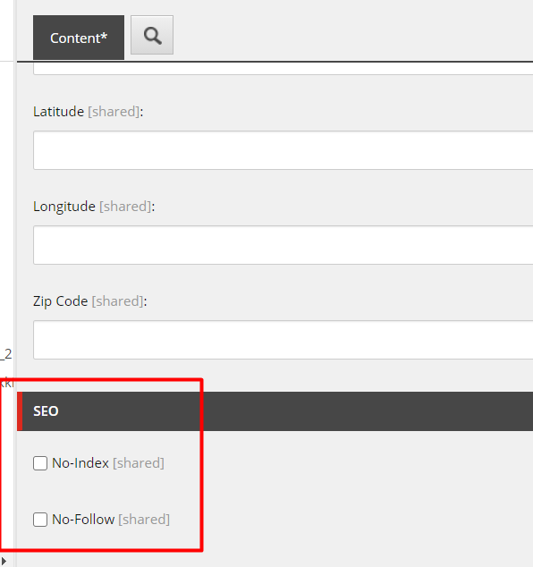
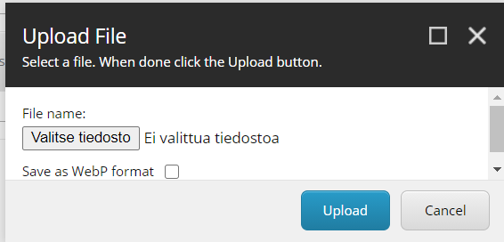

# KF Media Extensions - Kraftvaerk Finland Media Extensions
This document describes the use of KFMediaExtensions Sitecore module.
KFMediaExtensions includes two new features to Sitecore which extends the behaviour of using Media Library Items. Optimal idea would be that this would consist a bunch of new features to Media Library section of Sitecore.
During Sitecore Hackaton we managed to only create two new features to this module.

KFMediaExtensions includes these features:
1. X-Robots_Tag Header Feature: Possibility to add X-Robots-Tag header with noindex and nofollow value when serving files from Media Library
1. WebP Automatic Conversion: During uploading images to Media Library you are able to convert it to WebP format at the same time.

##  X-Robots-Tag Header Feature
Every Sitecore Media Item contains a new section called "SEO". There are two new checkboxes "No-Index" and "No-Follow". When one of these or both are checked Sitecore adds "X-Robots-Tag" header when serving files from Sitecore. This instructs search engines like googlebot not to index files or images.

### Problem
There are cases where search engines like BoogleBot have indexed files that are behind login. For example a search page where articles and files are shown but locked behind login. When accessing these files website usually prompts you have to be subscribed to the website in order to access materials/articles/files. But search engines doesn't know this and can index these files.

### Solution
X-Robots-Tag header when appended to Sitecore Media Files instructs search engines NOT to index these files. However not all search engines follow this rule, but based on Google documentation they will.

### Limitations
Only noindex and nofollow values are supported as other X-Robots-Tag values are not necessary when it comes to files. If this feature would be used on normal pages, then other X-Robots-Tag directives would be useful, thus when it comes to files only noindex and nofollow is supported.

## WebP Automatic Conversion
Editor can upload PNG or JPG image to Media Library and convert it to WebP during upload. Dialog has been extended with a checkbox that when checked Sitecore will convert it to WebP fileformat.

### Problem
It is very common that editors that does not understand or handle images well like sizes and resolution. This will cause unintentational slowness on website as pages takes longer to download with images where sizes are big.

### Solution
Possibility to convert images to WebP format during upload will reduce the size of the image. Also it doesn't require understanding of images or photoshopping for editor.

### Limitations
Editors cannot decide how much the image will be compressed.

## Installation
Locate a zip file under 'Install' folder called "KFMediaExtensionsModule.zip".
1. Login to sitecore
2. Go to Desktop
3. Lower left corner click Sitecore Logo -> Development Tools -> Installation Wizard. Alternatively you can go to from Launch Pad to Control Panel -> Install a package.
4. Locate KFMediaExtensions.zip from Install folder and install.
5. Go to /sitecore/templates/System/Media/Unversioned/File and publish to web database.

After installation all Sitecore Media Library files contains new section "SEO".

Also Upload File dialog contains new checkbox:

## How to deploy from repository
1. Open solution into the Visual Studio 2019
2. Restore Nuget Packages of whole solution
3. Publish Feature/MediaHandler project to the website folder of local Sitecore
4. Publish Project/Company project to the website folder local sitecore
5. Install from src/SitecorePackages/KFMediaExtensionsModule.zip
6. Go to /sitecore/templates/System/Media/Unversioned/File and publish to web database.

KFMediaExtensionsModule.zip contains changes to Sitecore templates and static files.